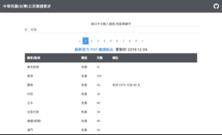

<p align="center">
  <a href="https://visa-requirement-tw.herokuapp.com/#/">
    
  </a>
</p>

<h3 align="center"> Visa Requirements for TW citizens </h3>
<h3 align="center"> 中華民國(台灣)公民簽證要求</h3>
<a href="https://visa-requirement-tw.herokuapp.com/#/">
  <p align="center">Click here to the demo site</p>
</a>

## Table of Contents
- [About this project](#about-this-project)
- [How to use](#how-to-use)
- [Run the local server](#run-the-local-server)
- [Run the frontend server](#run-the-frontend-server)

## About this project 
<p>Organize the visa-requirements PDF published by the ministry of foreign affairs in TW. This project offers the API and a page for users to search on their portable devices.</p>
<p>將台灣外交部上公布的 PDF 官方文件，整理成方便取用的 API 形式，並提供簡單的查詢介面。</p>

## How to use
**Website 網站**
<p>Please enter the search keywords in Chinese.</p>
<p>在中央的輸入框輸入中文關鍵字即可。</p>
<p align="center">
    
</p>

**API**
baseURL: 'https://visa-requirement-tw.herokuapp.com/api'
- 傳回所有國家/地區資料 (json)
```
<baseURL>/visa/countries
```
- 傳回特定單一國家/地區資料 (json)
```
<baseURL>/visa/countries/<Country/Region Name>
```
```
Ex: <baseURL>/visa/countries/Japan
```
- 查詢國家/地區資料 (json)
```
<baseURL>/visa/countries/search?q=<Countries/Regions Name with ',' >
```
```
Ex: <baseURL>/visa/countries/search?q=Japan,Korea,France
```

## Source Kits used in this project
**Front End**
- [axios](https://github.com/axios/axios) - Promise based HTTP client for the browser and node.js
- [bootstrap](https://getbootstrap.com/) - Build responsive, mobile-first projects on the web with the world’s most popular front-end component library.
- [sweetalert2](https://sweetalert2.github.io/) - A beautiful, responsive, customizable popup boxes
- [vue-fontawesome](https://github.com/FortAwesome/vue-fontawesome) - To offer high quality icons

**Back End**
- [cors](https://www.npmjs.com/package/cors) - To activate Cross-Origin Resource Sharing
- [faker](https://www.npmjs.com/package/faker) - To generate the seed data for testing

## Run the local server
### Prerequisites
- [npm](https://www.npmjs.com/get-npm)
- [Node.js v10.16.0](https://nodejs.org/en/download/)
- [MySQL Workbench](https://dev.mysql.com/downloads/workbench/)

### Clone

Clone this repository to your local machine

```
$ git clone https://github.com/andy922200/visa-requirements-for-tw-citizens.git
```
### Setup Database
**Create database via MySQL Workbench Panel**

```
> Run the following code
drop database if exists visa_requirement_tw_passport;
create database visa_requirement_tw_passport;
```

### Setup the Project on your device
**1. Enter the project folder**
```
$ cd visa-requirement-tw-passport
```
**2. Install packages via npm**

```
$ npm install
```
**3. Edit password in config.json file**
```
> /server/config/config.json
"development": {
  "username": "root",
  "password": "<YOUR_WORKBENCH_PASSWORD>",
  "database": "visa_requirement_tw_passport",
  "host": "127.0.0.1",
  "dialect": "mysql"
}
```
**4. Run migration**
```
> run the following code in the console  @ "/server"
$ cd /server
$ npx sequelize db:migrate
```
**5. Add Seeder**
```
> run the following code in the console  @ "/server"
$ npx sequelize db:seed:all
```
**6. Activate the server**
```
$ npm run dev
```
**7. Find the message on your console**
```
If you see the following message, the backend server is running.
> App is listening on port 3000!
```
You could access the api via: http://localhost:3000/api

## Run the frontend server
**1. Enter the project folder**
```
> Open a new terminal window and enter the client folder
$ cd visa-requirements-for-tw-citizens/client
```
**2. Install packages via npm**
```
$ npm install
```
**3. Add vue.config.js**
```
$ touch vue.config.js
```
**4. Add the following setting in vue.config.js**
```
> /client/vue.config.js
const path = require('path')

module.exports = {
  outputDir: path.resolve(__dirname, '../server/public'),
  devServer: {
    proxy: {
      '/api': {
        target: 'http://localhost:3000'
      }
    },
  }
}
```
**5. Compiles the webpack for development**
```
$ npm run serve
```
**6. Find the message on your console**
```
If you see the following message, the client server is running.
> App running at:
  - Local:   http://localhost:8080/
  - Network: http://<Your Virtual IP>:8080/
```
You could access the index page via the address mentioned above.

## Author
- [Andy Lien](https://github.com/andy922200)